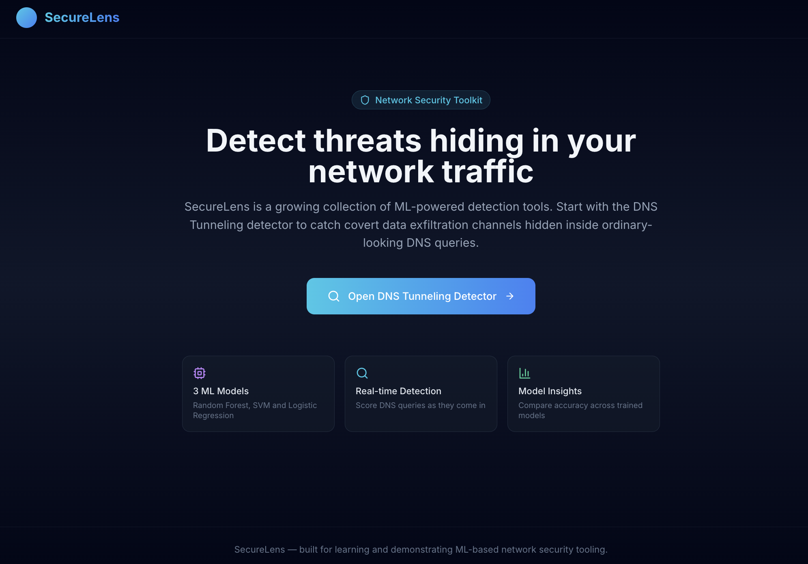
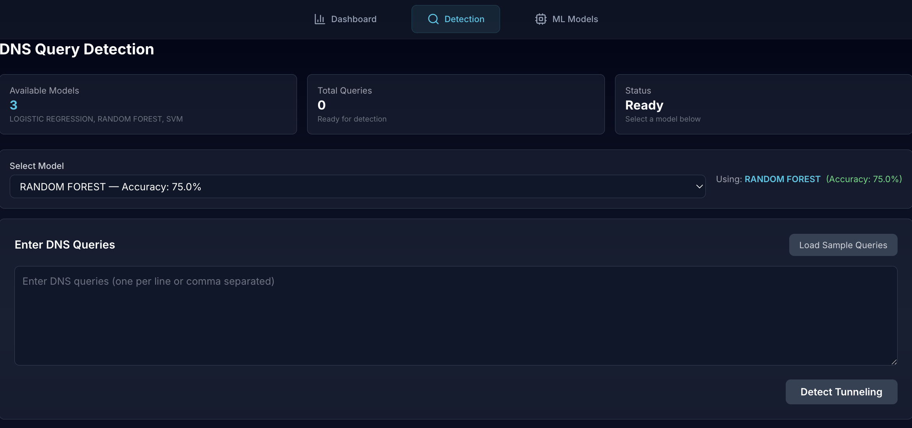
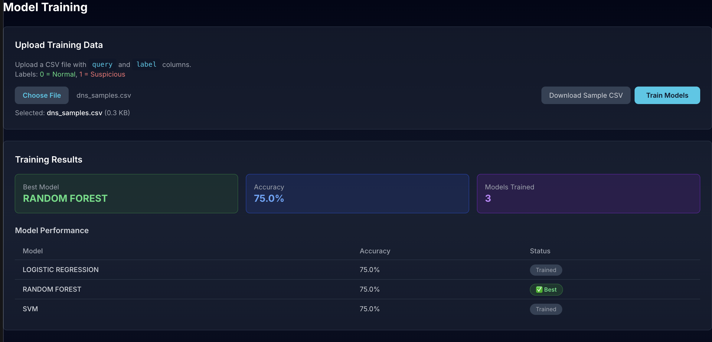

# SecureLens &mdash; DNS Tunneling Attack Detector

A React dashboard for detecting DNS tunneling &mdash; a technique attackers use to
smuggle data or command-and-control traffic through ordinary-looking DNS
queries. SecureLens lets you train multiple machine learning classifiers on
labeled DNS query data, compare their performance, and run real-time
detection on new queries.



> 📸 **Screenshots below are placeholders.** Replace the images in
> `docs/screenshots/` with real captures of your running app, keeping the same
> file names, and they'll appear here automatically.

## Table of contents

- [Features](#features)
- [Screenshots](#screenshots)
- [Tech stack](#tech-stack)
- [Project structure](#project-structure)
- [Getting started](#getting-started)
- [Backend API](#backend-api)
- [Available scripts](#available-scripts)
- [Roadmap](#roadmap)
- [Contributing](#contributing)
- [License](#license)

## Features

- 🤖 **Multiple ML models** &mdash; Random Forest, SVM, Logistic
  Regression trained side by side.
- ⚡ **Real-time detection** &mdash; paste or upload DNS queries and get an
  instant suspicious/normal verdict with a confidence score.
- 📊 **Model insights** &mdash; interactive accuracy charts and a best-model
  callout after every training run.
- 📁 **Flexible training data input** &mdash; type queries and labels
  directly, or upload a CSV.
- 🎨 **Polished, responsive UI** &mdash; built with React, React Router, and
  Tailwind CSS, designed to work from mobile to desktop.

## Screenshots

| Dashboard | Detection | Model Training |
|:---:|:---:|:---:|
|  |  |  |

<!--
  To add your own screenshots:
  1. Run the app locally (see "Getting started" below).
  2. Capture the Dashboard, Detection, and Models pages.
  3. Save them into docs/screenshots/ using the file names above
     (dashboard.png, detection.png, models.png).
  4. Commit the images — GitHub will render them inline in this README.
-->

## Tech stack

| Layer | Technology |
|---|---|
| UI framework | React 18 |
| Routing | React Router v6 |
| Styling | Tailwind CSS |
| Charts | Chart.js + react-chartjs-2 |
| Icons | lucide-react |
| HTTP client | axios |
| Backend (not included) | Any REST API implementing the [endpoints below](#backend-api) — the original project used Python/Flask + scikit-learn |

## Project structure

```
DNS_Tunelling/
├── public/
│   └── index.html
├── src/
│   ├── dns-tunneling/
│   │   ├── DNSTunnelingApp.jsx      # Layout + internal routes for the tool
│   │   ├── Navbar.jsx               # Dashboard / Detection / Models tabs
│   │   ├── Dashboard.jsx            # Landing page for the DNS tool
│   │   ├── Detection.jsx            # Run detection against DNS queries
│   │   ├── Models.jsx               # Train and compare ML models
│   │   └── components/
│   │       ├── StatsCard.jsx
│   │       └── FeatureCard.jsx
│   ├── pages/
│   │   └── Home.jsx                 # SecureLens platform landing page
│   ├── App.jsx                      # Top-level route definitions
│   ├── index.js                     # React entry point
│   └── index.css                    # Tailwind directives + global styles
├── docs/
│   └── screenshots/                 # README screenshot placeholders
├── .env.example
├── tailwind.config.js
├── postcss.config.js
└── package.json
```

## Getting started

### Prerequisites

- [Node.js](https://nodejs.org/) 18 or later
- npm (bundled with Node.js)
- A running backend that implements the [API below](#backend-api), or your
  own mock server, if you want live data instead of a UI-only preview

### Installation

```bash
# 1. Clone the repository
git clone https://github.com/SyedHashirA/DNS_Tunelling
cd DNS_Tunelling
# 2. Install dependencies
npm install

# 3. Configure the backend URL
cp .env.example .env
# edit .env if your backend isn't at http://localhost:5003

# 4. Start the dev server
npm start
```

The app will be available at `http://localhost:3000`. Visit
`http://localhost:3000/dns-tunneling` to open the detector directly.

### Building for production

```bash
npm run build
```

This outputs a static, deployable bundle to the `build/` directory, ready for
GitHub Pages, Vercel, Netlify, or any static host.

## Backend API

The frontend expects a REST backend exposing the following endpoints. Swap in
any implementation (Flask, FastAPI, Express, etc.) as long as it matches
these contracts:

| Method | Endpoint | Purpose |
|---|---|---|
| `GET` | `/api/health` | Health check used on app load |
| `GET` | `/api/models` | List available/trained model names |
| `GET` | `/api/sample-data` | Sample normal & suspicious queries for quick testing |
| `POST` | `/api/predict` | Run detection on a list of DNS queries |
| `POST` | `/api/train` | Kick off asynchronous training across all models |
| `GET` | `/api/training-progress` | Poll current training status/progress |
| `GET` | `/api/results` | Fetch the most recent training results |
| `POST` | `/api/validate-csv` | Validate an uploaded CSV before processing |
| `POST` | `/api/upload-csv` | Parse an uploaded CSV into queries + labels |

See `Detection.jsx` and `Models.jsx` for the exact request/response shapes
each call expects.

## Available scripts

| Command | Description |
|---|---|
| `npm start` | Run the app in development mode with hot reload |
| `npm run build` | Create an optimized production build |
| `npm test` | Run the test suite in watch mode |

## Roadmap

- [ ] Add a lightweight reference backend implementation
- [ ] Persist trained models between sessions
- [ ] Add authentication for multi-user deployments
- [ ] Expand SecureLens with additional detection tools beyond DNS tunneling

## License

Distributed under the MIT License. See [`LICENSE`](LICENSE) for details.
